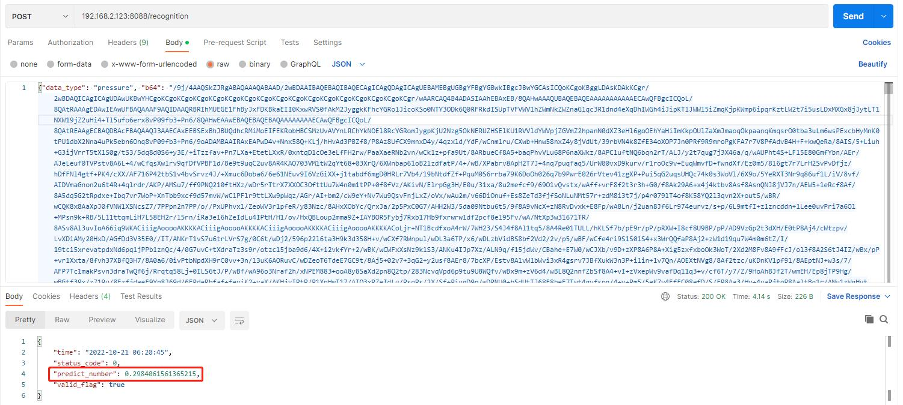

# image_recognition

图像识别相关算法

API说明:

以url的形式访问, 通过post方式提交, 参数以json方式写入body: 192.168.2.123:8088/recognition {"data_type": "pressure", "b64": ""}

data_type表示识别设备类型，不传该参数时默认识别燃气表，传入"pressure"表示识别压力表指针; b64为图片base64格式的数据

结果以json串的形式返回, valid_flag为true表示结果可用

识别示例：

1.压力表指针识别

2.燃气表识别
